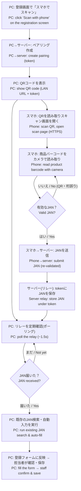
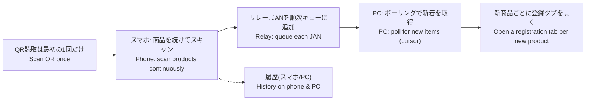

# スマホでバーコード検索 / Barcode search with a smartphone

商品登録画面で、スマホのカメラで商品バーコード（JAN）を読み取り、その番号をPCの登録画面へ送って自動入力する機能です。
A feature that lets you read a product's barcode (JAN) with a phone camera and send that number to the PC's registration screen to auto-fill it.

---

## 日本語（概要）

1. PCの登録画面で「AIで入力する」→「📱 スマホでスキャン」を押すと、PCがペアリング用のQRコードを表示します。
2. スマホのカメラでそのQRコードを読み取ると、スマホのブラウザでスキャン用ページが開きます。
3. スマホで商品のバーコードを枠に合わせると、JANコードを読み取ります。（QRなどJAN以外は無視します）
4. 読み取ったJANは、まずスマホ側で形式・チェックディジットを確認し、正しいJANだけをサーバーの中継（リレー）へ送ります。
5. PCはリレーを一定間隔で確認しており、JANが届くと自動で既存のJAN検索・自動入力が始まります。

ポイント：カメラ映像は端末内で処理され、画像は保存も送信もしません。送られるのはJANの数字だけです。スマホでカメラを使うにはHTTPS接続が必要です（httpの場合は手入力欄が使えます）。

## English (overview)

1. On the PC registration screen, choose "AI fill" → "📱 Scan with phone". The PC shows a pairing QR code.
2. Read that QR code with the phone camera; a scan page opens in the phone browser.
3. Point the phone at the product barcode; it reads the JAN. (Non-JAN codes such as QR are ignored.)
4. The phone first checks the JAN's shape and check digit, and sends only a valid JAN to the server relay.
5. The PC is polling the relay; when the JAN arrives, the existing JAN search / auto-fill starts automatically.

Note: the camera feed is processed on the device — no image is stored or uploaded; only the JAN number is sent. Using the phone camera requires an HTTPS connection (over http, use the manual-entry field instead).

---

## ワークフロー / Workflow (flowchart)



### テキスト版 / Text version

```
PC「スマホでスキャン」                         Phone (スマホ)
  │ create pairing (token)                       │
  ▼                                              │
PC: QRコード表示 ──── scan QR ───────────────▶ スキャン画面を開く (HTTPS)
  │                                              │
  │ poll relay (~1.5s) ◀───────┐                ▼
  │                            │            商品バーコード読み取り
  │                            │                 │ 有効なJANのみ
  │                            │                 ▼
  │                       Server relay ◀──── JAN送信 (再検証)
  │                       store JAN by token
  ▼ JAN arrived
PC: 既存のJAN検索・自動入力 → フォーム反映 → 担当者が確認・保存
```

---

## 複数商品の連続スキャン / Multiple-product scanning

一度ペアリング（QR読み取り）すれば、スマホで商品を**続けて何件でも**スキャンできます。新しい商品ごとにPC側で**登録タブが新しく開き**、その商品のJANで自動検索・自動入力が始まります。スマホとPCの両方に**スキャン履歴**が表示されます。
Pair once (scan the QR once), then scan **as many products as you like** in a row. Each **new** product opens its **own registration tab** on the PC and auto-runs the JAN search/auto-fill. A **scan history** is shown on both the phone and the PC.

- 同じJANを続けて読み取っても重複は除外されます（タブは商品ごとに1つ）。/ Duplicate JANs are de-duped (one tab per product).
- 自動でタブが開かない場合（ブラウザのポップアップブロック）は、PCの一覧の「開く」ボタンから開けます。サイトのポップアップを許可すると全自動になります。/ If a tab doesn't auto-open (pop-up blocker), use the "開く" button in the PC list; allow pop-ups for the site to make it fully automatic.



## 補足 / Notes
- 同じWi‑Fi（同一ネットワーク）であること。/ Phone and PC must be on the same Wi‑Fi/network.
- スマホのカメラはHTTPSが必須（自己署名証明書で可、初回のみ警告）。httpでは手入力が使えます。/ Phone camera requires HTTPS (a self-signed cert works, one-time warning); manual entry works over http.
- 送信されるのはJANの数字のみ。画像は保存・送信しません。/ Only the JAN number is transmitted; no image is stored or uploaded.
